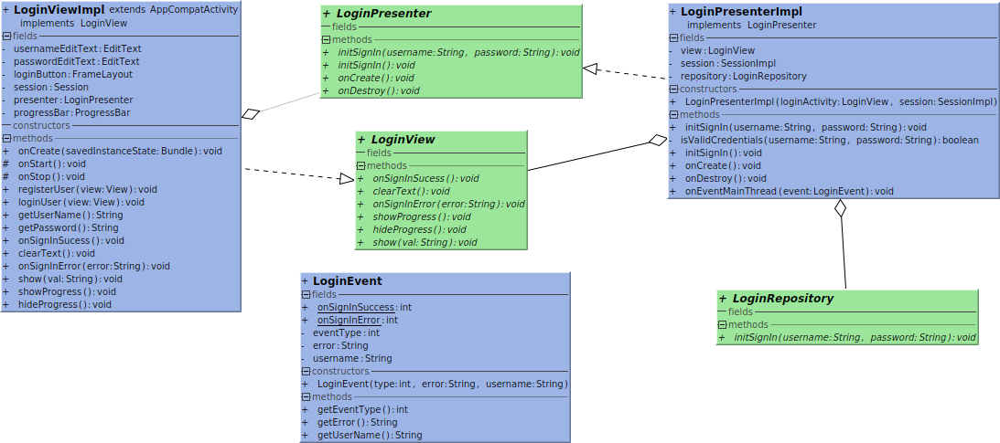
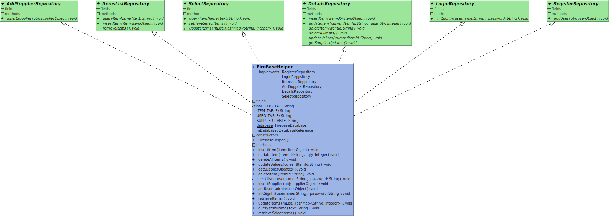

# Inventory Management

- This is a cloud based inventory management android application. Firebase is used as the real-time cloud based database.
- Provided with authentication system, multiple users share inventory and each of them is able to update the data.
- The services provided to the users are
  1. Add item.
  2. Edit item.
  3. Create new order.

## MVP

- To build this app, MVP architecture is used to achieve separation of concerns.

- All the activities form the view part of the architecture, each activity is provider with a presenter for the implementation of business logic.
- To implement the real-time database, EventBus library is used to post events and make changes to the views accordingly

## Class Structure

- As shown in the fig. above, to separate the model, view and the presenter, an interface is provided for the communication.
- Interface further helps in decoupling the components of the system. As the implementation can be changed in further iterations.

## Database

- To use the cloud-based library in this application, the FirebaseHelper class implements the interfaces used by all the presenters in this application.
- The class itself uses **singleton pattern**, to connect with the Firebase. It restricts the amount of open connections with the server to one.